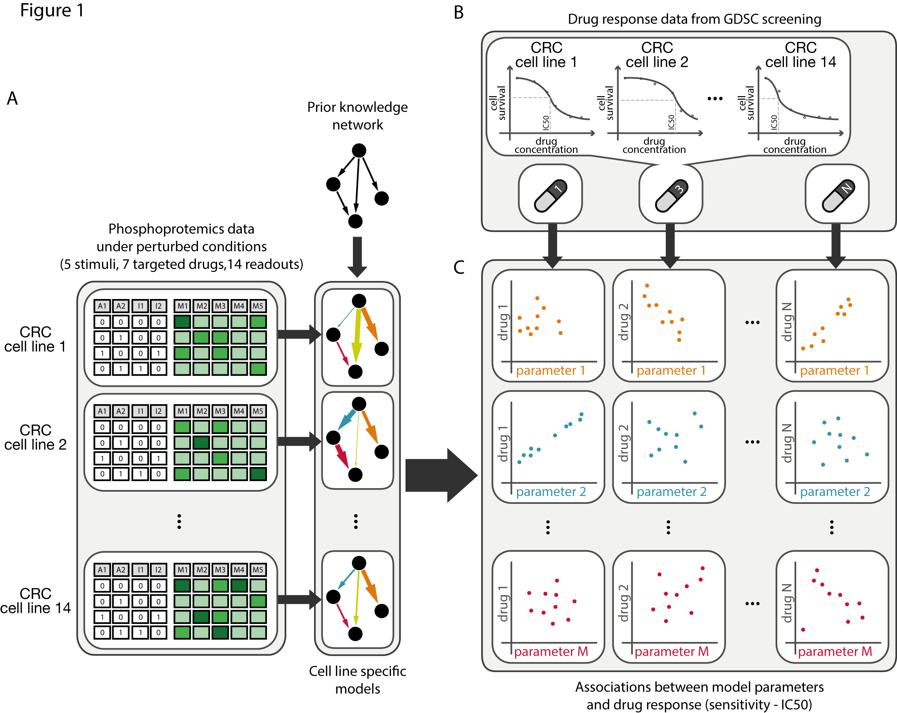
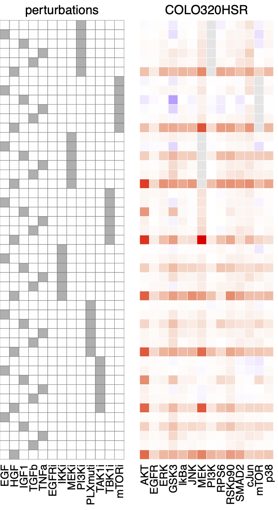
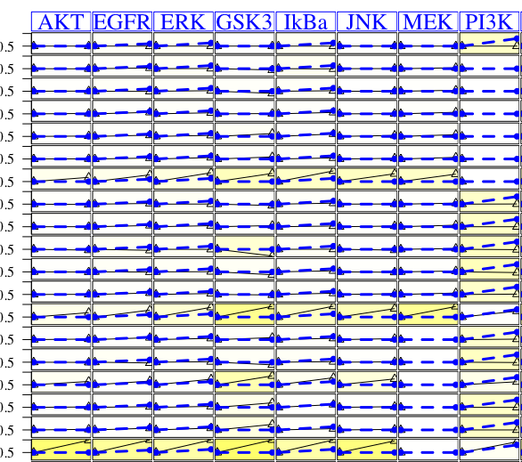
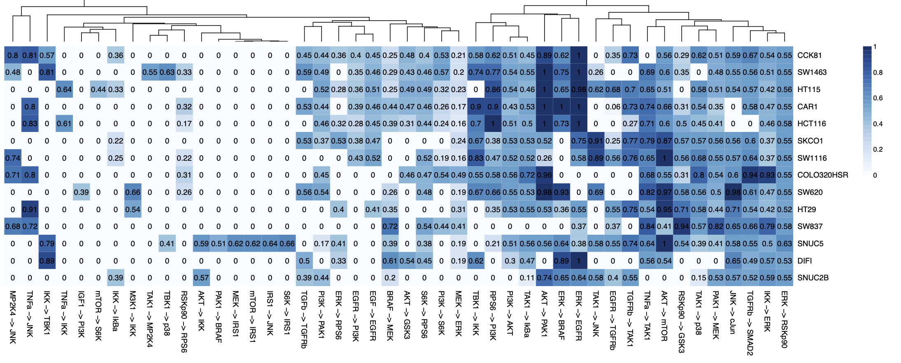
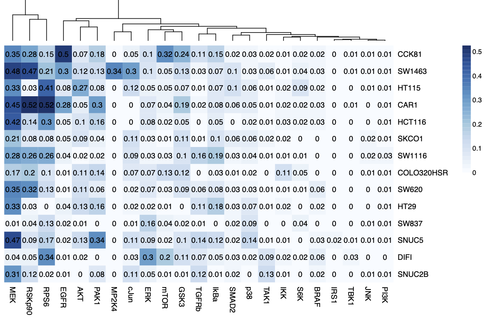
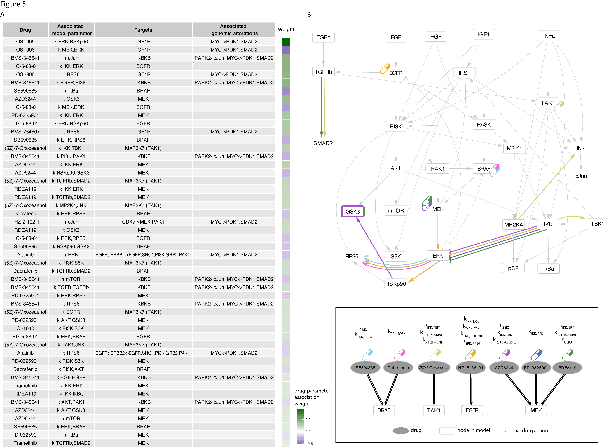

```{r setup, include=FALSE}
knitr::opts_chunk$set(echo = TRUE)
```


# Introduction

The goal of this tutorial is to show an example where dynamic logic model is used 
to predict drug response. 

The tutorial is based on the paper 

> Eduati et al (2017) Drug resistance mechanisms in colorectal cancer 
dissected with cell type-specific dynamic logic models. _Cancer Research_. 
DOI: 10.1158/0008-5472.CAN-17-0078

On Github: https://github.com/saezlab/CRC-pathway-biomarkers
 
We investigate here the drug-response of colorectal cancer cell lines. For this, we 
use drug response data and a signaling dataset. 


```{r,  out.width='100%'}

```


The Genomics of Drug Sensitivity in Cancer (GDSC), https://www.cancerrxgene.org/
offers drug response data for more than a 1000 human cancer cell lines, for houndreds of 
drugs. A small part of these data is can be found in `"./data/IC50_GDSC.csv".      `

The perturbation dataset contains the short time signaling response of 14 
colorectal cancer cell lines, where 14 phosphoproteins are measured under 43
perturbation conditions (5 stimuli, 7 inhibitors).

First, we construct signaling models based on the perturbation data to the cell
lines, here we use the CNORode modelling package. 
In the next step, we will associate model features to drug response to see why certain cell lines
respond to certain drugs and others do not. Here we use a linear modeling framework. 

## CNORode
CNORode is a member of the CellNOptR logic based tool family. It can translate
the network to ordinary differential equation (ODE) model, fit the model 
parameters to data and make predictions. 


# Dependencies
These should be already installed from previous tutorial. 

```{r message=FALSE, warning=FALSE}
# installs devtools package if not already installed
if(!require("devtools")) install.packages('devtools')

# installs CellNOptR and CNORode from GitHub: 
if(!require("CellNOptR")) devtools::install_github('saezlab/CellNOptR')
if(!require("CNORode")) devtools::install_github('saezlab/CNORode')

if(!require("dplyr")) install.packages('dplyr')
if(!require("readr")) install.packages('readr')
if(!require("tidyr")) install.packages('tidyr')
```

If you dont have `devtools` and cannot install it, then 

1. please visit the https://github.com/saezlab/CellNOptR and https://github.com/saezlab/CNORode 
websites,
2. download the toolboxes by clicking "Clone or download" then "Download Zip"
3. Unzip the files
4. In RStudio run:  
`install.packages("../CellNOptR-master", repos = NULL, type = "source")`  
`install.packages("../CNORode-master", repos = NULL, type = "source")` 

***
Make sure to import the libraries
```{r}
library(CellNOptR)
library(CNORode)
library(MEIGOR)

library(dplyr)
library(tidyr)
library(ggplot2)
```
# PART I: DRUG response exploration

```{r}
IC50 <- readr::read_csv("./data/tutorial_3/IC50_GDSC.csv") %>% rename("cell_line" = "X1")
print(IC50)
```

```{r}
IC50 %>% gather(drug_name, log_IC50, -cell_line) %>%
  ggplot() +
  geom_point(aes(drug_name, log_IC50,col=cell_line)) + 
  coord_flip() + 
  theme_bw() + 
  ggtitle("Drug response of 14 CRC cell lines")
```

Form the raw IC50 values we can see that there are some drugs that are more effective
(Trametinib) than others, like XMD14-99. 
There are also cell-line differences, for example, DIFI shows stronger sensitivity to 
Afatinib than any other cell lines. What could be the reason for this? 


# PART II: cell-line models
The goal of part II is to build a cell-line specific model from the perturbation
data using CNORode.

This model is an ordinary differential equation (ODE) model, where the equation for
each state ($x_A$) can be written as 
$$\frac{dx_A}{dt} = \tau_A(B(f_1(x),f_2(x),...)-x_A) $$
here

- $f_i(x)$ represents the incoming edges on node $A$ with a transfer function. 
This transfer function typically has an S-shape. 
$$ f(x) = \frac{x^n}{x^n+k^n}$$

- $B$ is a Boolean homologue function. This is responsible to combine the incoming
edges with the OR and AND gates. For example, an OR gate is represented by $x_1\cdot x_2$.
- $\tau$ is a time parameter, that tells how fast node A adapts to the input.
- the model has free parameters: a $\tau$ for each node, and ($k$,$n$) for each edge. These
are found by optimisation. 


The main differences are that in ODE models the states are continuous values, therefore
it is quantitative, not only qualitative like a Boolean model. Further, here
we hace to find the specific edge and node parameters. 

What do we need to build and simulate a differential equation model? 

- the equations are derived from the network graph
- inputs: given in the MIDAS description
- Initial conditions for each state in each experiment 

In this example, the baseline is set to 0.5. A value of 1 means full activation 
and 0 means full inhibition of the node. 


## Perturbation data
The following heatmap shows an overview on the perturbation data. 
The first block outlines the combinations of treatment. Then each other block
represents the response of a cell line. Different columns within a block shows the 
different phosphoprotein markers. 


```{r, echo=FALSE, out.width='100%'}
knitr::include_graphics("./data/tutorial_3/dataHeatmap_raw.png")
```

In the tutorial we make a single model for the first cell line _COLO320HSR_. 

```{r, echo=FALSE, out.width='30%'}

```


## Model a single cell line

Similarly to the previous tutorial with CellNopt, here we also start by importing 
a prior knowledge network and the perturbation data in MIDAS format.


```{r}
# load Prior Knowledge Network (PKN)
pknmodel<-readSIF("./data/tutorial_3/PKN.sif")

# load normalised perturbation data 
# select MIDAS file for the desired cell line
MIDASfile <- "./data/tutorial_3/processed/MIDAS/MD-COLO320HSR_Ktuned_v1_n4_all_noEGFRi_CNORode.csv"

Mydata<-readMIDAS(MIDASfile=MIDASfile,verbose = FALSE)
cnolist<-makeCNOlist(Mydata, subfield=F)
cnolist$valueStimuli[cnolist$valueStimuli==0]=0.5
```

Show the network first
```{r}
plotModel(pknmodel,cnolist)
```

As in CellNOPt:

- green nodes are stimulated in some experiments
- blue nodes are measured
- white nodes are modelled, but not measured
- red nodes or red bordered nodes are occasionally inhibited
- black edges represents activation, red T-shaped arrows represents inhibition


Then the data in CellNOpt format: 
```{r}
plotCNOlist(cnolist)
```

The data is very large, therefore is hard to see the details, but we can notice as 
some nodes increases their activity at the final time (30 mins). 


```{r}
# compress the network (no expansion, only OR gates are considered)
model<-preprocessing(data=cnolist, model=pknmodel, compression=TRUE, expansion=FALSE)

# set initial parameters (here parameters 'k' and 'tau' are optimised and 'n' fixed to 3)
ode_parameters <- createLBodeContPars(model, 
                                      LB_n = 1, LB_k = 0, LB_tau = 0,
                                      UB_n = 3, UB_k = 1, UB_tau = 1,
                                      default_n = 3,
                                      default_k = 0.5,
                                      default_tau = 0.01,
                                      opt_n = FALSE, opt_k = TRUE, opt_tau = TRUE,
                                      random = TRUE)

# PLX -> BRAF is an artificial regulation used to model paradoxical effect of PLX4720,
# which works as selective BRAF inhibitor in cell-lines where BRAF is mutated in
# V600E (i.e. HT29 and SNUC5 in our panel), but induces a paradoxical activation
# of wild type BRAF cells (modeled as stimulus on those cell lines)
ode_parameters$parValues[which(ode_parameters$parNames=="PLX_k_BRAF")]<-0.5
ode_parameters$index_opt_pars<- setdiff(ode_parameters$index_opt_pars,
                                        which(ode_parameters$parNames=="PLX_k_BRAF"))

## Parameter Optimization
# essm
paramsSSm=defaultParametersSSm()
paramsSSm$local_solver = "DHC"
paramsSSm$maxtime = 30; #36000;
paramsSSm$transfer_function = 4;
```

The actual optimisation takes around 10 mins, instead of the 30 sec. 
So, instead of running it here, we just load the results: 

```{r, eval=FALSE}
opt_pars = parEstimationLBode(cnolist, model, method="essm",
                              ode_parameters=ode_parameters,
                              paramsSSm=paramsSSm)
#write_rds(opt_pars,"data/tutorial_3/opt_pars_30sec.RDS")
```

```{r}
opt_pars <- read_rds("data/tutorial_3/opt_pars_30sec.RDS")

```

Plot the fit of the model: 

```{r}
sim_res <- CNORode::plotLBodeFitness(cnolist,model,ode_parameters = opt_pars)
```
```{r, echo=FALSE, out.width='50%'}

```

The fit is a bit better than a random model, but these optimisations should be run
for around 10 hours. 

We are interested in the optimised model parameters of this model. 

```{r}
opt_par_values <- opt_pars$parValues
names(opt_par_values) <- opt_pars$parNames
opt_par_values

```

Similar to the above cell-line, we can build a model for each of the cell lines. 
This is very time consuming, therefore we just load the optimised parameters from the 
paper. 

```{r}
optimised_parameters <- read_delim("./data/tutorial_3/allModelsParameters.txt",delim = "\t")
```

Let's check edge and node parameters. 

```{r, out.width='100%'}
edge_id <- grep("_k_",colnames(optimised_parameters))
edge_parameters_HM <-  optimised_parameters[edge_id]%>% as.matrix()
rownames(edge_parameters_HM) <- optimised_parameters$Cell_line
# heatmap(edge_parameters_HM, main = "Cell line edge parameters")


```

```{r, out.width='100%'}
node_id <- grep("tau_",colnames(optimised_parameters))
node_parameters_HM <-  optimised_parameters[node_id]%>% as.matrix()
rownames(node_parameters_HM) <- optimised_parameters$Cell_line
# heatmap(node_parameters_HM, main = "Cell line node parameters")

```
The level of edge and node parameters differs across the cell-lines. 


# PART III: Associate model parameters and drug response

Which model parameters correlates with drug response IC50 ? 
```{r message=FALSE, warning=FALSE}
# first we need to remove the parameters, that are zero across all the models
zero_pars <- names(which(colMeans(optimised_parameters[,-1]) == 0))

# join the IC50 data and network model parameters based on cell_lines
drug_model_data <- optimised_parameters %>% select(-zero_pars) %>%
  gather(parameter,par_value,-cell_line) %>%
  left_join(IC50 %>% gather(drug, IC50,-cell_line),by = "cell_line")


# for each drug and each parameter compute the correlation coefficient

corr_data <- drug_model_data %>% group_by(drug, parameter) %>%
  summarise(corr_par_drug = cor(par_value,IC50,use = "complete.obs"))

```

Let's show some correlation
```{r}
corr_data %>% arrange(desc(abs(corr_par_drug))) %>% print(.,n=25)
```

```{r}
drug_model_data %>% filter(drug=="Afatinib",parameter=="tau_TBK1") %>%
  ggplot() + geom_point(aes(par_value,IC50)) + 
  ggtitle("DRUG: Afatinib; parameter: tau_TBK1")
```

Think what the problem might be here?  
We have only 14 cell-lines, therefore each of the correlations between model 
parameter and drug IC50 is based on 14 data points. There are 31 drugs and 89 model
parameters, which results in `31*89=2759` tests. 

Also this is only a single parameter - single drug association. It is possible, that
the existence of multiple edges makes a cell-line sensitive/resistant. Therefore
(Eduati et al) derived linear models, that funds multiple parameters at the same 
time.


```{r, out.width='100%'}

```

